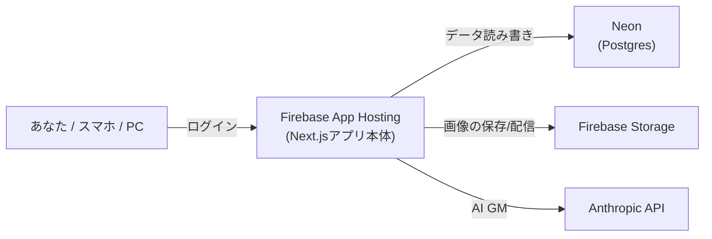

# デプロイ手順（Firebaseへ公開する）

このアプリを **インターネット上に公開して、どの端末からでも使えるように** するための手順です。
構成は **Firebase App Hosting（アプリ本体）+ Firebase Storage（画像）+ Neon（無料Postgres）** です。個人利用なら各サービスの無料枠に収まる想定です。

> ⚠️ **公開する前に必ず `APP_PASSWORD` を設定してください。** 設定しないと誰でもアクセス・全削除でき、APIキーを使い込まれます。



---

## 前提

- [Node.js](https://nodejs.org/) と [Firebase CLI](https://firebase.google.com/docs/cli)（`npm i -g firebase-tools`）
- GitHubにこのリポジトリがあること（App HostingはGitHub連携でデプロイします）
- 支払い方法を登録したGoogleアカウント（Firebaseの **Blazeプラン**。無料枠内なら実質無料ですが、App Hosting/Storageの利用にBlazeが必要です）

---

## ① データベースを用意する（Neon）

1. [Neon](https://neon.tech/) で無料アカウントを作り、プロジェクトを作成
2. 表示される **接続文字列**（`postgresql://...@...neon.tech/...?sslmode=require`）を控える
3. 手元でテーブルを作成する（このリポジトリのフォルダで実行）:

   ```bash
   DATABASE_URL="（Neonの接続文字列）" npx prisma migrate deploy
   ```

   > スキーマを変更したときも、同じコマンドをNeonに対して実行してから再デプロイします。

---

## ② Firebaseプロジェクトを用意する

1. [Firebase Console](https://console.firebase.google.com/) でプロジェクトを作成（Blazeプランにアップグレード）
2. **Storage** を有効化 → バケット名（例 `your-project-id.appspot.com`）を控える
3. `apphosting.yaml` の `FIREBASE_STORAGE_BUCKET` の値を、このバケット名に書き換える

   Storageの公開読み取りルール（`storage.rules`）例:

   ```
   rules_version = '2';
   service firebase.storage {
     match /b/{bucket}/o {
       match /uploads/{file=**} {
         allow read: if true;       // 画像は誰でも閲覧可 (URLを知っている人のみ)
         allow write: if false;     // 書き込みはサーバー(サービスアカウント)のみ
       }
     }
   }
   ```

---

## ③ シークレット（機密情報）を登録する

App Hosting のシークレット機能（Cloud Secret Manager）に登録します:

```bash
firebase apphosting:secrets:set DATABASE_URL       # Neonの接続文字列
firebase apphosting:secrets:set ANTHROPIC_API_KEY  # https://console.anthropic.com/ のキー
firebase apphosting:secrets:set APP_PASSWORD       # ログイン用パスワード (自分で決める)
firebase apphosting:secrets:set AUTH_SECRET        # ランダムな長い文字列 (例: openssl rand -base64 32)
```

`apphosting.yaml` がこれらを参照します（値そのものはコミットしません）。

---

## ④ デプロイする

1. Firebase Console → **App Hosting** → 「バックエンドを作成」から、このGitHubリポジトリと**デプロイするブランチ**を接続
2. 以後、そのブランチにpushすると自動でビルド＆デプロイされます
3. 発行されたURL（例 `https://xxxx.web.app`）を開き、`APP_PASSWORD` でログイン

> スマホでそのURLを開き、ブラウザメニューの「ホーム画面に追加」でアプリのように使えます（PWA）。

---

## 補足・注意

- **AI GMの応答が途中で切れる場合**: AI GMは数分かかることがあります。Cloud Run（App Hostingの実行基盤）の **リクエストタイムアウト** を延ばしてください（GCPコンソール → Cloud Run → 該当サービス → 編集 → リクエストタイムアウトを300秒以上に）。
- **コスト**: 個人利用の範囲ならApp Hosting/Storage/Neonともほぼゼロですが、Blazeプランは従量課金です。念のためGCPの予算アラートを設定しておくと安心です。
- **バックアップ**: 公開後も、ダッシュボードの「バックアップ」から全データをJSONで書き出せます（画像は含まれないので、必要ならStorageも別途退避）。
- **ローカル開発**: [README.md](./README.md) の手順（Docker Postgres）で従来どおり動きます。`APP_PASSWORD` 未設定ならローカルはログインなしで動作します。
