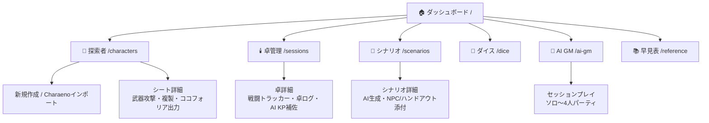
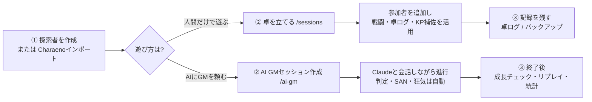
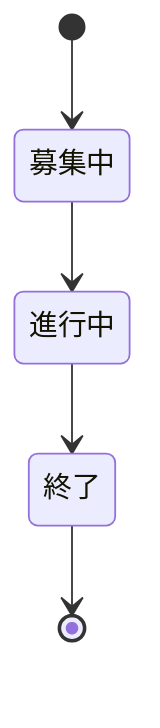
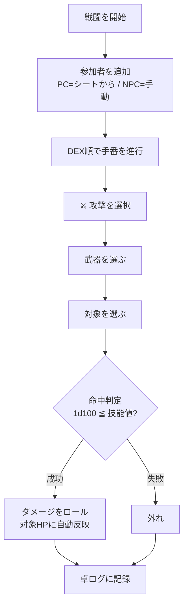
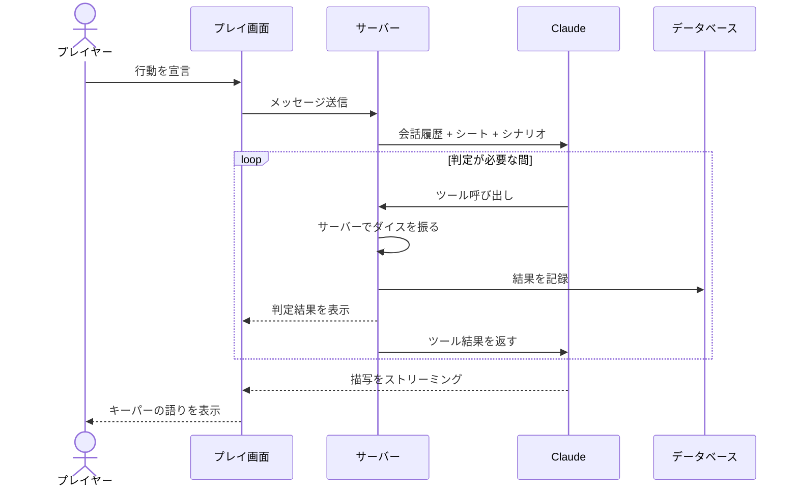
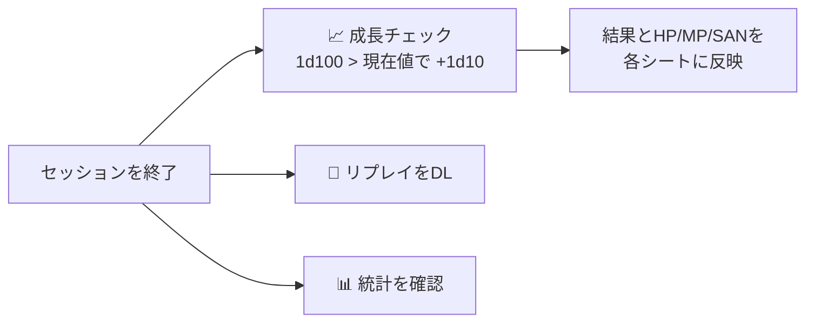
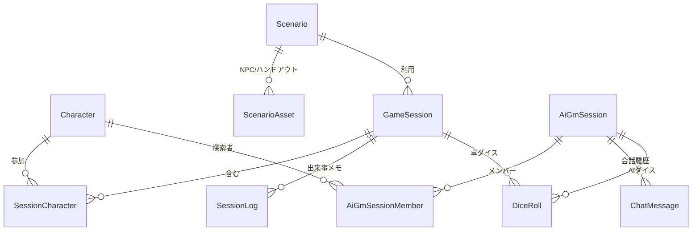

# TRPG Central 使い方ガイド

クトゥルフ神話TRPG(6版/7版)の管理サイト **TRPG Central** の利用ガイドです。
人間だけで遊ぶ卓の管理から、**Claudeがキーパー(GM)を務めるAI GMプレイ**まで対応しています。

> セットアップ手順(インストール・APIキー設定)は [README.md](./README.md) を参照してください。
> このガイドは「起動後に何がどこでできるか」を説明します。

---

## 目次

1. [全体像(サイトマップ)](#全体像サイトマップ)
2. [はじめての流れ](#はじめての流れ)
3. [探索者を管理する](#探索者を管理する)
4. [ダイスを振る](#ダイスを振る)
5. [卓(セッション)を管理する — 人間だけで遊ぶ](#卓セッションを管理する--人間だけで遊ぶ)
6. [AI GMプレイ — Claudeに進行を頼む](#ai-gmプレイ--claudeに進行を頼む)
7. [シナリオを管理する](#シナリオを管理する)
8. [便利機能(早見表・バックアップ・PWA)](#便利機能早見表バックアップpwa)
9. [データの関係(モデル図)](#データの関係モデル図)
10. [制約・注意点](#制約注意点)

---

## 全体像(サイトマップ)

ヘッダーのナビゲーションから各機能にアクセスできます。

---

## はじめての流れ

まず探索者を1人作り、遊び方に応じて「人間卓」か「AI GM」に進みます。

---

## 探索者を管理する

**メニュー: 📜 探索者**

### 新規作成

「**+ 新規作成**」から作成します。

- **版の選択**: 6版 / 7版(作成後は変更不可)
- **能力値**: 「🎲 全部ロール」で自動生成、または手入力
- **技能割り振り**: 職業ポイント+趣味ポイントの範囲で配分。カスタム技能も追加可
- **立ち絵**: 画像をアップロード(PNG/JPEG/WebP/GIF、5MBまで)
- **武器**: プリセット(こぶし・ナイフ・拳銃)またはカスタム。ダメージ式に `DB` と書くとダメージボーナスに自動変換されます(例: `1d4+DB`)

### Charaenoからインポート

「**⬇ インポート**」から、Charaeno(新クトゥルフ7版)でエクスポートしたJSONを貼り付け/選択して取り込めます。

- 能力値・技能・基本情報・幸運・現在SANを取り込みます
- 技能名は自動で正規化されます(例: 拳銃 → 射撃(拳銃))
- **武器と立ち絵は取り込まれません**(取り込み後に手動で登録してください)

### シート詳細でできること

| 操作 | 説明 |
|---|---|
| ⚔️ 武器攻撃 | 武器の「攻撃」ボタンで命中判定+ダメージロールをワンタップ実行 |
| 🎭 ココフォリア出力 | チャットパレット付きの駒JSONをクリップボードにコピー |
| 📄 複製 | 消耗前の状態を残したいときにシートを複製 |
| 📊 プレイ記録 | 参加したAI GM卓・通算成績・SAN推移を表示 |

---

## ダイスを振る

**メニュー: 🎲 ダイス**

- **汎用ロール**: `1d100`・`3d6` などのプリセット、または `1d6+1d4+2` のような複合式
- **技能判定**: 探索者を選ぶと技能ボタンが並び、ワンタップで判定。7版はボーナス/ペナルティダイスに対応
- **🌀 狂気表**: 6版(一時的狂気)/7版(狂気の発作)を1d10で引けます
- **履歴**: 直近のロールが一覧表示されます

---

## 卓(セッション)を管理する — 人間だけで遊ぶ

**メニュー: 🕯️ 卓管理**

卓には「募集中 → 進行中 → 終了」のステータスがあります。

卓詳細ページには次のパネルが縦に並びます。

### ⚔️ 戦闘トラッカー

DEX順のイニシアチブ管理・HP増減・ラウンド送りに加え、**武器攻撃**に対応しています。

- PC を戦闘に追加すると、登録済みの武器が技能値付きで引き継がれます
- NPC はその場で武器(技能値・ダメージ式)を追加できます

### 📜 卓ログ

ダイス履歴と、GMが手入力した出来事メモを **時系列でまとめて表示** します。戦闘の攻撃ロールもここに記録されます。

### 🐙 AI KP補佐

人間がキーパーを務める卓の相談相手です。NPCのセリフ案・情景描写・ルール裁定などをチャットで相談できます(進行そのものはしません)。※ APIキーの設定が必要です。

---

## AI GMプレイ — Claudeに進行を頼む

**メニュー: 🐙 AI GM** ※ APIキーの設定が必要です。

探索者を1〜4人選んでセッションを作成すると、Claudeがキーパーとしてシナリオを進行します。判定・SANチェック・狂気表は **すべてサーバー側でダイスを振る** ため、AIが出目を勝手に決めることはありません。

### プレイ中の機能

| 機能 | 説明 |
|---|---|
| 🔊 音声読み上げ | キーパーの語りをブラウザ音声で読み上げ(ソロプレイの没入感UP) |
| 📊 統計 | SAN推移グラフ・出目分布・技能別成績を表示 |
| 📄 リプレイDL | セッションログを読み物風Markdownでダウンロード |
| 📈 成長チェック | セッション終了後、経験した技能の成長判定→各シートに反映 |

### 終了後の流れ

---

## シナリオを管理する

**メニュー: 📖 シナリオ**

- シナリオの保存・検索・タグ管理
- **AIシナリオ自動生成**: テーマ・舞台・ホラー度を指定してClaudeに生成させる(要APIキー)
- **NPC・ハンドアウト資料**の添付。NPC資料はAI GMセッション作成時に自動でキーパーへ連携されます

---

## 便利機能(早見表・バックアップ・PWA)

### 📚 ルール早見表

**メニュー: 📚 早見表** — 6版/7版の判定・SAN・戦闘・成長ルールの要点をカード形式で参照できます。

### 💾 バックアップ

ダッシュボードの「バックアップ」カードから操作します。

- **ダウンロード**: 探索者・シナリオ・プレイログを含む全データをJSONで書き出し
- **復元(インポート)**: バックアップJSONから全データを復元(現在のデータは置き換えられます)
- ⚠️ 立ち絵などの **画像ファイルは含まれません**(別途 `public/uploads/` を退避してください)

### 📱 PWA(ホーム画面に追加)

ブラウザの「ホーム画面に追加/インストール」から、アプリのように起動できます。一度開いたページはオフラインでも閲覧できます(新しいデータの読み込み・保存には接続が必要です)。

---

## データの関係(モデル図)

主要なデータの関係は次のとおりです。

- **Character(探索者)** は人間卓(SessionCharacter経由)にもAI GM卓(AiGmSessionMember経由)にも参加できます
- **DiceRoll** は人間卓(gameSessionId)またはAI GM卓(aiGmSessionId)に紐づき、卓ログや統計の元データになります
- AIプレイ中のHP/MP/SANは **セッション専用のスナップショット** で管理され、マスターのシートを直接書き換えません(反映は成長チェックで明示的に行います)

---

## 制約・注意点

- **AI機能(AI GM・KP補佐・シナリオ生成)** には `ANTHROPIC_API_KEY` の設定が必要です。未設定でも、それ以外の全機能は動作します
- **認証はありません**。1人〜身内でのローカル利用を想定しています。インターネットに直接公開しないでください
- **立ち絵などの画像** は `public/uploads/` に保存されます。バックアップJSONには含まれないため、別途退避が必要です
- **Charaenoインポート** は7版のキャラクターシートJSONを対象としています。武器・立ち絵は取り込まれません
- **オフライン(PWA)** は、初回に開いたことのあるページのみ閲覧できます。未訪問ページの表示やデータ保存には接続が必要です
